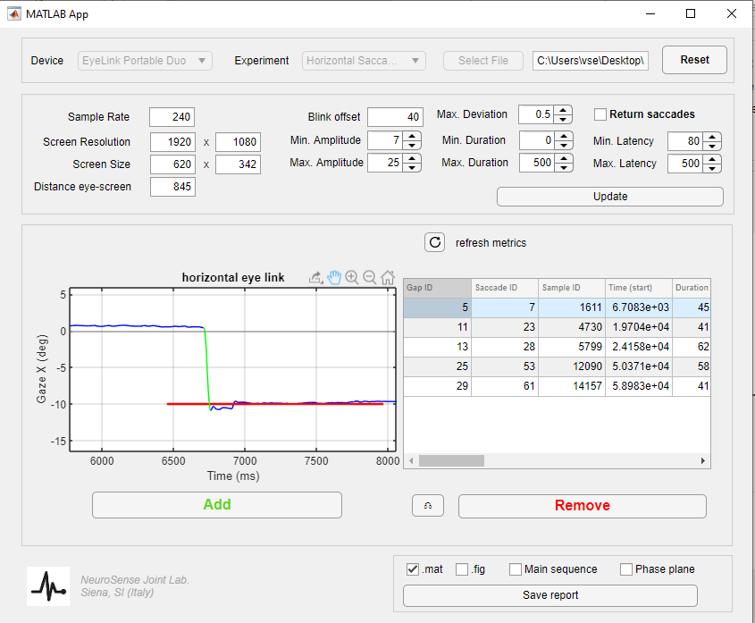

# SaccadeAnalysisMatlabApp
A scientific tool with an effective and simple graphical user interface realized with Matlab App Designer to upload raw gaze data and create saccade reports

Preview screenshot:

# Data format
The M-App currently support the analysis of eye-tracking data from Eye-link devices extracted as a .txt sample report with the following columns
- Gaze_X
- Gaze_Y
- Pupil_size
- Timestamp
- Target_X
- Target_Y

Where Gaze_X and Gaze_Y indicate the gaze position on the screen, while Target_X and Target_Y indicate the position of the visual stimulus (target) of the visually guided task.

Please notice: Some experimental setup (user/screen distances, screen size, ...) are hard cabled in the software. Please verify your experimental setup is aligned with our standard values.

# Usage
The M-App is intended to be used to let a human expert evaluate each segmented saccade and eventually discard wrong segmentations. A saccade can be selected and visualized my clicking on the corresponding row on the left-hand side table. To remove it from the list, click the button underneath "remove saccade". Options below allow for thresholding criterions. Once all saccades are checked individually, the human expert can save the resulting report.

# Citation
If you use this software, please cite

@misc{Zanca2020,
  author = {Zanca, Dario},
  title = {Saccade Analysis Matlab App},
  year = {2020},
  publisher = {GitHub},
  journal = {GitHub repository},
  howpublished = {\url{https://github.com/dariozanca/SaccadeAnalysisMatlabApp}}
}
